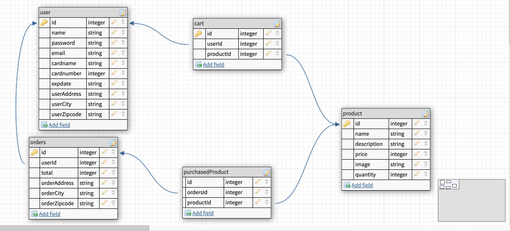

# unit3groupProjectBackend 
# Elias, RZ, Clement 
# ecommerce store 
This project will be an ecommerce store. We will create a store to sell diffrent products.

For this project, we will build an e-commerce full stack application that allows users to place items to the cart and make an order. 

## User Stories

1. When the user visits the site, a home page is display that just has a simple welcome message.
1. When not logged in, the user sees links to home, signup & login only. If he/she were to visit any of these routes manually while logged in, he/she would get redirected to the home page.

1. When logged in, the user sees links to home, logout, All Products, My Cart, and My Orders. If he/she were to visit any of these routes manually while logged out, he/she would get redirected to the home page.

1. The All Products page lists the names of all available products. Clicking on any product name takes the user to its details page, which include a name, description, image, and price. In the Product Details page is an Add To Cart button, which saves the product in user's cart. If he/she wants to buy more than 1 of a product in an order, he/she can add it to the cart multiple times, and each one is displayed as a distinct product. (There's no way to buy in bulk.)

1. The My Cart page lists products that the user has put into my cart. Next to each product is a Remove From Cart button, which removes the item from the cart (the item should disappear from the page without requiring a page refresh). The total of user's order is displayed on the page. There is a Checkout button which creates an order containing all the items from my cart, then empties the cart. In order to checkout, the user must input an address and a credit card number and get redirected to the my orders page. 

1. The My Orders page displays a list of my completed orders, using the date of the order as a clickable link. When the user clicks on a single order, he/she sees the Single Order page, which shows its products (name and price), the total price of the order, and the credit card & address.

## MVP

1. The user can create an account, log in, and log out.

2. The user should be able to add many items to the cart

3. The user should be able to see a list of all products

4. The user should be able to place an order.

## STRECH GOALS
1. The admin user should be able to manage products
2. The admin user should be able to mark orders from all users as shipped.
3. Use a 3rd party API like Stripe to process payments

## The technologies we will be using are:

- Javascript
- Express
- Node.js
- Postgres
- HTML /CSS
- React
- Stripe API

## ERD

